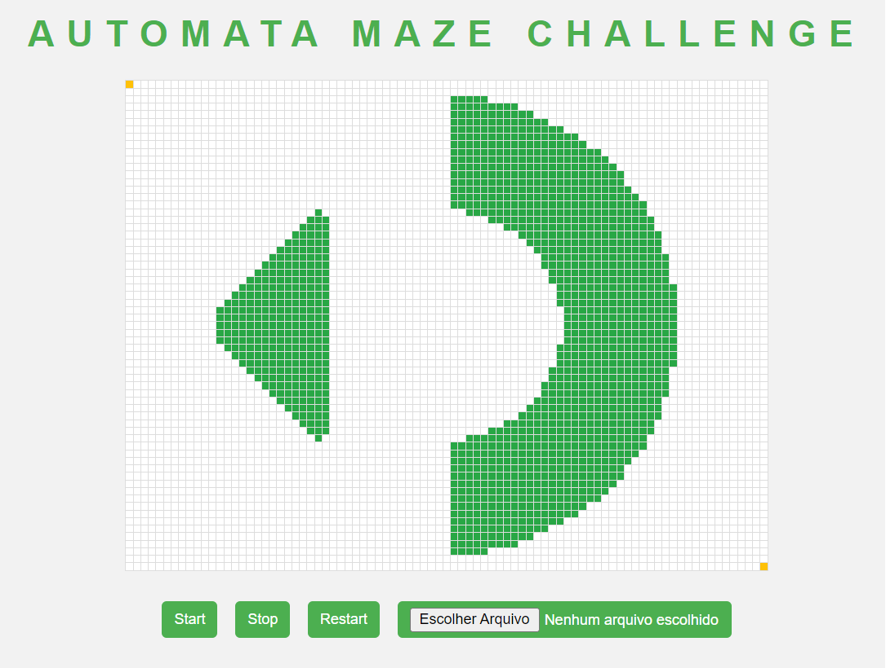

# Automata Maze Challenge

This is a simple JavaScript program that generates and solves a maze using the Depth-first search algorithm. The user can upload a text file containing the initial matrix that represents the maze, and then input a path to solve the maze.

In my case, the file with the initial matrix already exists and to solve the problem, there is a second file with the path to be traversed.

## Getting Started

To run the program, simply open the `index.html` file in your browser. The maze will be displayed on the screen. To solve the maze, select a text file with path by clicking on the "Choose File" button, input the file in the corresponding input field, and click the "Start" button.

## Dependencies

The program uses the Fetch API to read the text file and the Promise-based sleep function to pause the animation.

## Features

- Generates and solves a maze using Depth-first search algorithm.
- Allows the user to upload a text file containing the initial matrix that represents the maze.
- Allows the user to input a path to solve the maze.
- Animates the path from the start to the end of the maze.
- Stops the animation when the user clicks on the "Stop" button.
- Shows a congratulatory message when the animation reaches the end of the maze.
- Provides a "Restart" button to reload the page and start over.

## Limitations

- The program has been tested on a limited number of mazes, and some mazes may not render properly or may not be solvable. As it was made for a challenge, the focus was on solving the challenge due to deadlines and my lack of time to study and work.

## Acknowledgments

This program was developed as part of a coding challenge by SigmaGeek

## License

This program is licensed under the MIT License. See the [LICENSE](LICENSE) file for details.
